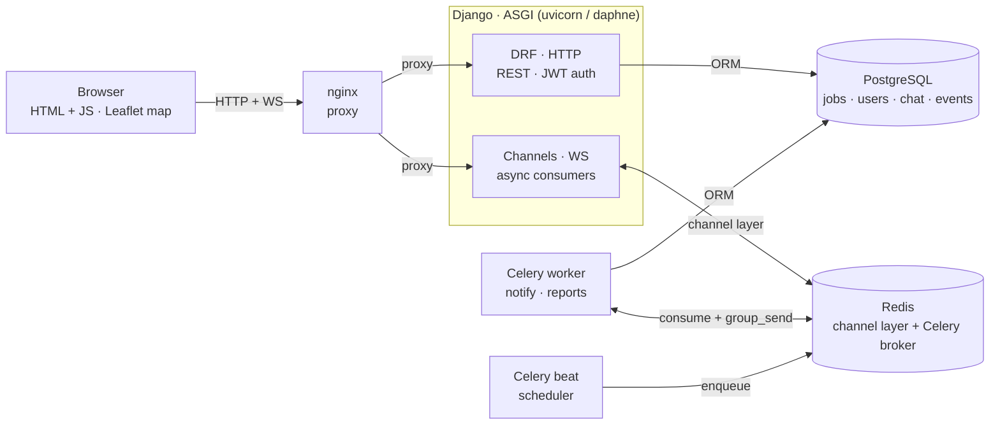
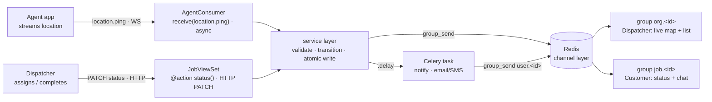
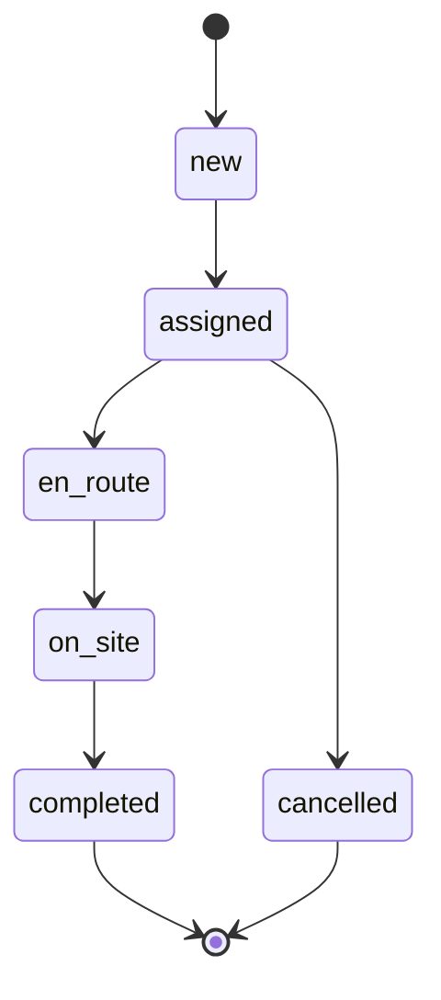

# FieldSync — Architecture Reference

Backend architecture reference for the whole 3–4 week build. See [`system-design.md`](./system-design.md) for the production posture (SLOs, scaling, security, ops) built on top of this.

**Stack:** Django 5 + DRF · Django Channels (WebSockets) · Celery + Redis · PostgreSQL · Docker Compose · GitHub Actions CI · frontend: thin HTML + JS

**Contents:** 1. The problem & the actors · 2. System architecture · 3. The real-time mechanism · 4. Data model · 5. REST API contract · 6. WebSocket contract · 7. Background jobs · 8. Repo structure · 9. Advanced-Python targets · 10. The 4-week plan · 11. Definition of done

---

## 1. The problem & the actors

A small plumbing, HVAC, or appliance-repair business runs on phone calls and guesswork. The office doesn't know where its technicians are, customers phone in asking "how long?", and nobody has a record of when a job actually changed hands. FieldSync gives them one live picture. Three kinds of people use it, and their differing permissions are what make the authorization work non-trivial — which is exactly what this project is meant to practise.

| Role | Sees | Can do |
|---|---|---|
| **Dispatcher** | Everything in their organization | Creates jobs, assigns them to agents, watches the whole fleet move on a map, sees every status change live |
| **Agent** | Only jobs assigned to them | Streams their location, advances a job through its states, chats with the customer — cannot see other agents' jobs |
| **Customer** | Only their own job | Sees its live status, chats with the assigned agent — no dashboard, no other jobs |

Everything hangs off one central object — the **Job** — and its movement through a small, strict set of states is the spine of both the API and the real-time layer.

## 2. System architecture

One Django project runs as an **ASGI application**: the same process serves ordinary REST requests (through DRF) *and* long-lived WebSocket connections (through Channels), routed by protocol. Redis plays two roles at once — the Channels layer that lets processes broadcast to each other, and the Celery broker. Everything runs as containers brought up with one `docker compose up`.



*Why it matters:* the Channels lane and the Celery worker both reach clients through the **same Redis channel layer** — a background task can push a WebSocket message to a browser without holding any connection itself. That indirection is the whole trick of scaling real-time.

| Service | Image / base | Job in the system |
|---|---|---|
| `web` | `python:3.12-slim` | ASGI server (uvicorn) running DRF + Channels. The only container browsers talk to. |
| `worker` | same image | Celery worker. Runs `celery -A config worker` — notifications, reports, retries. |
| `beat` | same image | Celery beat. Fires scheduled tasks (reminders, stale-location sweep, nightly report). |
| `db` | `postgres:16` | Primary datastore. A named volume keeps data across restarts. |
| `redis` | `redis:7` | Channels layer *and* Celery broker/result backend. |
| `nginx` | `nginx:alpine` | Serves static files, proxies HTTP + WS upgrades to `web`. |

`web`, `worker`, and `beat` share **one image** and differ only in their start command. In Week 4 that becomes a **multi-stage Dockerfile** so the final image ships without build tools.

## 3. The real-time mechanism

Live updates arrive by two completely different transports — an **agent's location ping over WebSocket** and a **dispatcher's status change over plain HTTP** — yet both end up as a single `group_send` into the Redis channel layer, which fans the message out to every browser subscribed to the relevant group.



*The claim:* transports differ, destinations don't. A WS ping and an HTTP action both flow through the service layer to `group_send`, and the channel layer decides who hears it by **group name** — `org.<id>` for the whole fleet, `job.<id>` for one job's participants, `user.<id>` for a person. From a sync DRF view, reach it with `async_to_sync(channel_layer.group_send)`; a Celery worker calls the same thing.

> **The one gotcha to internalise:** Consumers are **async**; DRF views and Celery tasks are **sync**. Crossing that boundary is where beginners get stuck: use `async_to_sync(...)` to call the channel layer from sync code, and `database_sync_to_async(...)` to touch the ORM from inside an async consumer. Keep the actual business logic in a plain sync `services.py` so both worlds call the same function.

## 4. Data model

Deliberately small — nine tables. A **custom user model with a `role`** is table one (never skip this in a new Django project; adding it later is painful). `Job` is the hub; `JobEvent` is an append-only audit trail of every transition, which doubles as great data for the nightly report.

| Entity | Key fields |
|---|---|
| **User** *(auth · custom)* | `id` UUID · `email` unique · `role` (dispatcher\|agent\|customer) · `full_name` · `organization` → Organization |
| **Organization** *(tenant)* | `id` UUID · `name` · `timezone` |
| **AgentProfile** *(1–1 user)* | `user` → User (agent) · `status` (online\|offline\|busy) · `last_lat`/`last_lng` · `last_ping_at` · `skills` |
| **Job** *(the hub)* | `id` UUID · `reference` · `status` · `priority` (low\|normal\|urgent) · `address`/`lat`/`lng` · `scheduled_for` · `customer` → User · `agent` → User (nullable) · `organization` → Organization |
| **JobEvent** *(append-only audit)* | `job` → Job · `from_status` · `to_status` · `actor` → User · `created_at` |
| **ChatMessage** *(per job)* | `job` → Job · `sender` → User · `body` · `created_at` (indexed) |
| **Notification** *(per user)* | `recipient` → User · `kind` (assigned\|arriving\|…) · `title`/`body` · `read_at` |

Job status is a strict state machine:



Encode that state machine explicitly — a dict of `{status: {allowed_next}}` checked in the service layer, so an illegal jump like `new → completed` raises a validation error rather than silently corrupting data.

> The full ER diagram (relationships, cardinalities, indexes) is formalized in the companion `data-model.md`.

## 5. REST API contract

JWT auth via `djangorestframework-simplejwt`. Every endpoint is filtered by the caller's role through a custom permission class and a scoped queryset — a dispatcher sees the org's jobs, an agent sees only assigned ones, a customer sees only their own. Document it all automatically with `drf-spectacular` (Swagger UI at `/api/docs/`).

| Method | Endpoint | Purpose | Who |
|---|---|---|---|
| POST | `/api/auth/token/` | Obtain access + refresh JWT | all |
| POST | `/api/auth/token/refresh/` | Refresh access token | all |
| GET | `/api/me/` | Current user + role + org | all |
| GET | `/api/jobs/` | List jobs (role-scoped, filtered, paginated) | all |
| POST | `/api/jobs/` | Create a job | dispatcher |
| GET | `/api/jobs/{id}/` | Job detail | participants |
| POST | `/api/jobs/{id}/assign/` | Assign an agent (custom action, atomic) | dispatcher |
| PATCH | `/api/jobs/{id}/status/` | Transition status (validated by state machine) | agent · dispatcher |
| GET | `/api/jobs/{id}/events/` | Status history (audit trail) | participants |
| GET | `/api/jobs/{id}/messages/` | Chat history (paginated) | participants |
| GET | `/api/agents/` | Agents + latest location | dispatcher |
| GET | `/api/notifications/` | My notifications | all |

**Design note:** the REST layer is the source of truth and the only thing that writes to the database. WebSockets never write directly — a chat message posted over WS still goes through the same service function the REST endpoint uses. One code path, tested once.

## 6. WebSocket contract

Three consumers, three group families. Authenticate the socket from the JWT (a small middleware that reads the token from the query string or a subprotocol), then join the caller to the groups their role allows. Every message is a small JSON envelope with a `type` field.

**Endpoints & groups**

| Route | Consumer | Joins group(s) | Used by |
|---|---|---|---|
| `/ws/dispatch/` | DispatchConsumer | `org.<org_id>` | dispatcher |
| `/ws/agent/` | AgentConsumer | `org.<org_id>`, `user.<id>` | agent |
| `/ws/jobs/<id>/` | JobConsumer | `job.<job_id>` | participants |

**Message envelopes**

| Dir | `type` | Payload | Effect |
|---|---|---|---|
| ▲ in | `location.ping` | `{lat,lng,heading}` | Agent streams position → broadcast to `org` |
| ▼ out | `agent.location` | `{agent_id,lat,lng,at}` | Marker moves on every dispatcher map |
| ▼ out | `job.update` | `{job_id,status,agent_id,at}` | Status change pushed to `org` + `job` |
| ▲ in | `chat.message` | `{body}` | Sent in a job room → persisted → broadcast |
| ▼ out | `chat.message` | `{id,sender,body,at}` | Appears for all job participants |
| ▼ out | `notify` | `{kind,title,body}` | Personal toast pushed to `user.<id>` |

`▼ out` events are named to match the channel-layer handler methods on the consumer (Channels turns `{"type": "job.update"}` into a call to `job_update(self, event)`). That naming symmetry is worth getting right early.

## 7. Background jobs (Celery)

Real async work, not toy sleeps. Two triggers: some tasks are fired from a view with `.delay()`, others by Celery beat on a schedule.

| Task | Trigger | Does |
|---|---|---|
| `notify_status_change(job_id)` | on demand | Fired when a job transitions. Renders + "sends" an email/SMS (log it in dev), writes a `Notification` row, and pushes a `notify` event to `user.<id>`. `autoretry_for` + backoff. |
| `send_upcoming_reminders()` | beat · every 15 min | Finds jobs scheduled soon with no reminder yet and notifies the customer. Idempotent: mark rows so a re-run doesn't double-send. |
| `expire_stale_locations()` | beat · every 2 min | Flips agents to `offline` if `last_ping_at` is older than a threshold, and broadcasts the change to `org`. |
| `daily_ops_report()` | beat · nightly | Aggregates the day's `JobEvent`s per org into a summary. A natural place to generate a CSV/PDF artifact. |

## 8. Repo structure

A single Django project, apps split by domain, business logic pulled out of views into `services.py` — the structure that keeps the async/sync boundary clean and the tests honest.

```
fieldsync/
├─ config/                 # project: settings split, asgi.py, celery.py, routing
│   ├─ settings/           # base.py · dev.py · prod.py (django-environ)
│   ├─ asgi.py             # ProtocolTypeRouter: http → DRF, websocket → Channels
│   └─ celery.py
├─ apps/
│   ├─ accounts/           # custom User, roles, JWT, permissions
│   ├─ jobs/               # Job, JobEvent, state machine ← the core
│   │   ├─ models.py
│   │   ├─ serializers.py
│   │   ├─ views.py        # thin — delegates to services
│   │   ├─ services.py     # transition(), assign() — sync, single source of truth
│   │   ├─ consumers.py    # async: DispatchConsumer, AgentConsumer, JobConsumer
│   │   ├─ tasks.py        # celery tasks
│   │   └─ tests/
│   ├─ chat/               # ChatMessage + JobConsumer chat handlers
│   └─ realtime/           # channel-layer helpers, JWT ws middleware
├─ frontend/               # thin HTML + JS: dispatcher map, agent simulator, job page
├─ deploy/
│   ├─ Dockerfile          # multi-stage
│   ├─ docker-compose.yml  # web · worker · beat · db · redis · nginx
│   └─ nginx.conf          # proxy_pass + WS upgrade headers
├─ .github/workflows/ci.yml  # ruff · mypy · pytest · build image
├─ pyproject.toml          # deps, ruff, mypy, pytest config
└─ README.md               # architecture diagram + run instructions
```

> The concrete, file-by-file version of this layout — with the module boundaries that enforce the service-layer discipline above — is formalized in the companion `repo-structure.md`.

## 9. Advanced-Python targets

The point of the project is *how* it's built, not just that it runs. Skills to consciously hit:

- [ ] Service layer keeps logic out of views & consumers — one sync function both the REST view and the WS consumer call
- [ ] Full type hints, checked with `mypy` in CI — including Django-stubs / DRF-stubs
- [ ] Async consumers with `database_sync_to_async`, and `async_to_sync` for group_send from sync code
- [ ] Explicit job state machine with guarded transitions — illegal transitions raise, not corrupt
- [ ] Race-safe assignment: `select_for_update` + `atomic` — two dispatchers can't grab the same agent
- [ ] Custom object-level DRF permissions per role, plus role-scoped querysets
- [ ] `pytest` + `factory_boy` + `pytest-asyncio` — unit, API, and WebsocketCommunicator tests; coverage gate
- [ ] 12-factor settings split & env config — base/dev/prod, secrets from environment
- [ ] Celery retries, backoff, and idempotent tasks — safe to re-run without double effects

## 10. The 4-week plan

Front-loaded so the hard, unfamiliar part — real-time — lands in Week 3 once the API underneath it is solid and dockerised. Each week ends with something that runs and is tested.

### Week 1 — Foundations that run in Docker
- Repo, `pyproject.toml`, ruff + mypy, pre-commit
- `docker compose`: web + db + redis, live-reload
- Custom `User` + roles, JWT auth
- `Job`, `Organization`, `AgentProfile` models + migrations
- DRF CRUD + role permissions, drf-spectacular docs
- pytest baseline + first API tests

**Done when:** you can log in and CRUD jobs through Swagger, in containers, with tests green.

### Week 2 — Business logic & async tasks
- State machine + `services.py` (transition, assign)
- `assign/` & `status/` actions, race-safe
- `JobEvent` audit trail
- Celery worker + beat wired to Redis
- `notify_status_change` + one scheduled task
- Seed script / fixtures; push coverage up

**Done when:** status changes are validated, audited, and fire a background notification.

### Week 3 — Real-time layer (the hard part)
- ASGI + Channels + Redis channel layer
- JWT WebSocket auth middleware
- Dispatch / Agent / Job consumers
- Location, status, and chat events end-to-end
- Thin HTML+JS: dispatcher Leaflet map + agent simulator + job page
- WebsocketCommunicator tests

**Done when:** a simulated agent moves on the dispatcher's map and status/chat update live.

### Week 4 — Hardening & delivery
- GitHub Actions CI: ruff → mypy → pytest → build image
- Multi-stage Dockerfile, non-root, healthchecks
- nginx proxy with WS upgrade; prod compose
- README with architecture diagram + demo script
- Coverage badge, final polish, record a demo GIF

**Done when:** one command boots the stack and CI is green on every push.

## 11. Definition of done

What makes this portfolio-grade rather than a tutorial clone:

- [ ] `git clone` → `docker compose up` → working app, documented in README
- [ ] Live demo: agent moves on map, status + chat update with no refresh
- [ ] CI green on every push; tests cover REST, services, and a WebSocket flow
- [ ] OpenAPI docs served at `/api/docs/`
- [ ] README opens with the architecture diagram and the problem it solves
- [ ] A short demo GIF or clip in the README

> **Scope discipline:** if you fall behind, cut chat before you cut the live map — the map is the memorable demo. Keep the real-time set small and finished rather than large and broken. Depth on one working project beats breadth.
