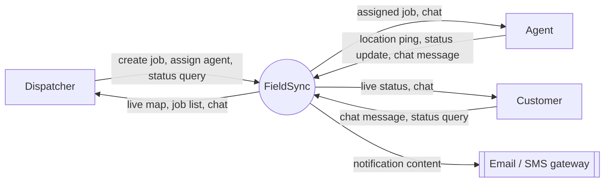
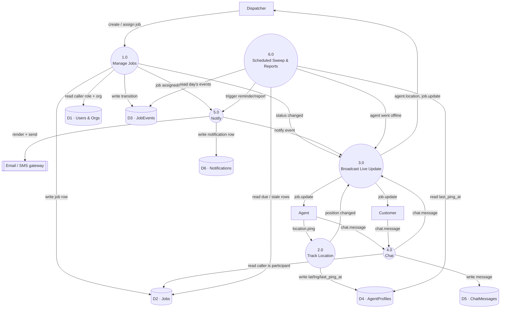

# FieldSync — Data Flow Diagram

**Companion docs:** [`architecture.md`](./architecture.md) · [`system-design.md`](./system-design.md) · [`data-model.md`](./data-model.md) · `repo-structure.md` (pending)

The [ER diagram](./data-model.md) shows the *structure* data sits in. This shows *movement*: which process touches which store, in what order, and what crosses the boundary to a person or an outside service. Standard DFD notation — a rectangle is an external entity (outside the system), a rounded/circle shape is a process (something that transforms data), a cylinder is a data store (a table from `data-model.md`), and every arrow is a named flow, not a generic connection.

## Level 0 — context diagram

The whole system as one process, and everything that crosses its boundary.

Three human external entities, one machine external entity (the notification gateway is a boundary FieldSync only ever *sends* to — see `system-design.md` §1, payments and SMS delivery are explicitly out of scope beyond that single outbound flow).

## Level 1 — process decomposition

The six processes that actually do the work, and the seven data stores from `data-model.md` they read and write. `D1` merges `Organization`+`User` here for readability — the ER diagram is the authority on their real structure.

## Reading the diagram against the code

Every process above is one thing, and only one thing, in the repo — that's the point of the service-layer rule in `architecture.md` §3.

| # | Process | What it does | Where it lives (per `architecture.md` §8) |
|---|---|---|---|
| 1.0 | Manage Jobs | Create, assign, and validate status transitions against the state machine | `apps/jobs/services.py` — `create()`, `assign()`, `transition()` |
| 2.0 | Track Location | Accept an agent's position, stamp `last_ping_at` | `apps/jobs/consumers.py` `AgentConsumer.receive()` → a services function, never written to the DB from the consumer directly |
| 3.0 | Broadcast Live Update | Fan a change out to every socket in the relevant group | `apps/realtime/` — the `group_send` wrapper every other process calls, sync or async |
| 4.0 | Chat | Persist a message, only for a job's actual participants | `apps/chat/services.py` — `post_message()` |
| 5.0 | Notify | Write a `Notification` row and attempt external delivery | `apps/jobs/tasks.py` — `notify_status_change()`, Celery, retried on failure |
| 6.0 | Scheduled Sweep & Reports | Time-triggered reads across jobs/agents/events | `apps/jobs/tasks.py` — `send_upcoming_reminders()`, `expire_stale_locations()`, `daily_ops_report()`, all fired by Celery beat |

## What this view adds that the others don't

- `architecture.md` §3 shows *one* flow (an update reaching a browser) in detail. This shows *all six* flows and where they share a process — every one of them ends at **3.0 Broadcast Live Update**, which is exactly why that single `group_send` wrapper is worth getting right once rather than reimplementing per feature.
- `system-design.md` §4 shows *deployment* topology (replicas, queues, instances). This shows *logical* data movement independent of how many replicas run it — the diagram doesn't change when the web tier scales from one instance to five.
- `data-model.md` shows what a row looks like at rest. This shows what has to happen, in what order, for a row to get there — e.g. a `ChatMessage` is never written before **4.0** confirms the sender is a participant in `D2`, which is the multi-tenancy rule from `data-model.md` expressed as an ordering constraint instead of a schema constraint.
