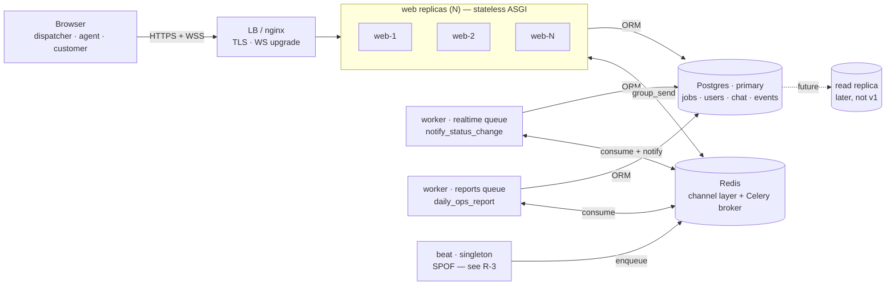
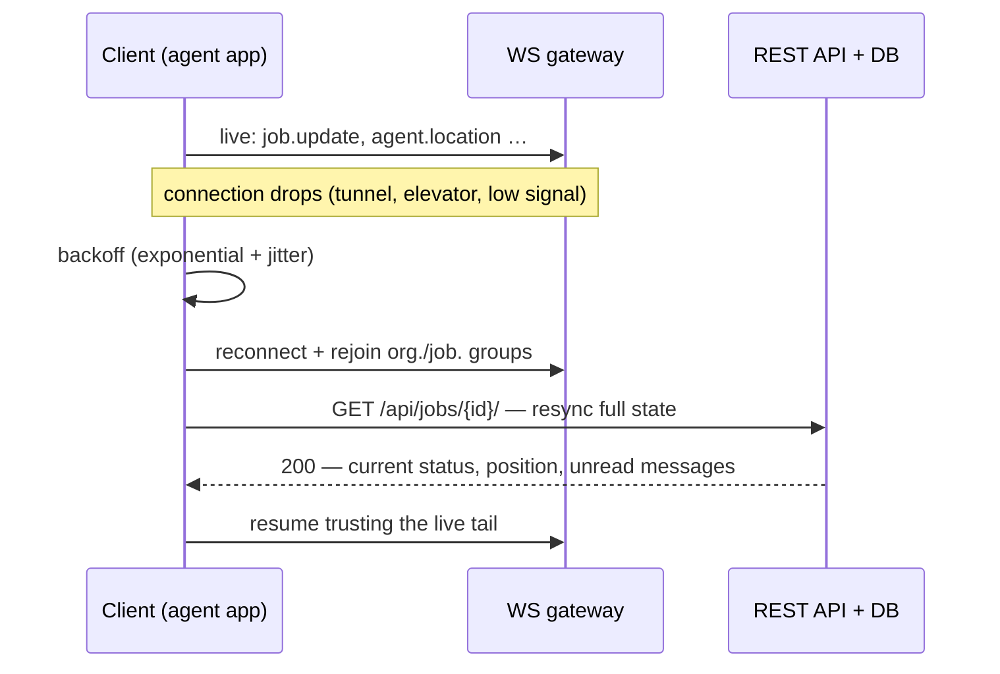

# FieldSync — System Design Document

**Doc ID:** FS-SDD-01 · **Version:** 0.1 · **Status:** draft — under review · **Last updated:** 2026-09-14
**Companion docs:** [`architecture.md`](./architecture.md) (done) · `data-model.md` (pending) · `repo-structure.md` (pending)

How the real-time dispatch platform is built to actually run in production: what it must guarantee, where it can fail, and how it scales, is secured, and is operated once it's live — not just how it works in a demo.

**Contents:** 0. How to read this · 1. Purpose & scope · 2. Goals & non-goals · 3. Requirements & SLOs · 4. Architecture & topology · 5. Real-time delivery guarantee · 6. Security & multi-tenancy · 7. Scaling & deployment · 8. Observability & operations · 9. Risks & open questions · 10. Delivery plan · Glossary

---

## 0. How to read this document

This is the first of three companion documents for FieldSync, a real-time dispatch platform for small field-service businesses. **This one sets the architecture, the guarantees, and the production posture** — what the system promises, where it's allowed to be simple, and where it can't be. The **data model (ER diagram)** and the **repo structure** follow as separate documents that implement the decisions made here, so neither is duplicated in this one.

Read it top to bottom once; after that, use it as a reference — section 9 in particular is meant to be revisited every time a scaling or security assumption changes.

## 1. Purpose & scope

A small plumbing, HVAC, or appliance-repair business runs dispatch on phone calls and guesswork: the office doesn't know where a technician is, a customer calling in gets "let me check," and no one has a record of when a job actually changed hands. FieldSync replaces that with one live picture, shared by the dispatcher, the field agent, and the customer, each seeing exactly the slice they're entitled to.

"Production-ready" here doesn't mean hyperscale — it means the system is built with the discipline one would apply at scale: correctness of the job lifecycle, tenant isolation that can't leak, a real story for what happens when a process crashes or a socket drops, and a deploy that a stranger could run from the README. Sized for real load, not imagined load.

**In scope — v1**
- Dispatcher, agent, and customer web experiences
- REST API + WebSocket real-time layer, one write path
- Background jobs: notifications, reminders, reports
- Containerized deploy, single region, CI-gated releases
- Role-based auth, per-organization data isolation

**Explicitly out of scope — v1**
- Native mobile apps (the agent client is a mobile-web page)
- Multi-region failover / active-active deployment
- Payments, invoicing, or billing
- Offline-first agent app (assumes intermittent, not absent, connectivity)
- Enterprise SSO / SCIM provisioning

## 2. Goals & non-goals

Naming what this system is *not* trying to do is as load-bearing as naming what it is — it's what keeps the scaling and security sections honest instead of aspirational.

**Goals**
- A job's status is always correct and auditable — no illegal state jumps, no silent overwrites
- A status or location change is visible to every entitled viewer in under a second, perceived as instant
- One organization can never see another's jobs, agents, or messages — enforced, not just hidden by the UI
- `docker compose up` and a CI badge are enough for a stranger to trust and run it
- Every write has one code path, so it only needs to be gotten right once

**Non-goals**
- Sub-100ms, HFT-grade delivery latency
- Tens of thousands of concurrent organizations on one deployment
- Geo-distributed active-active writes
- A general-purpose workflow engine — the job state machine is intentionally fixed, not user-configurable

## 3. Requirements & SLOs

### 3.1 Who needs what

| Role | Needs | Must never see |
|---|---|---|
| **Dispatcher** | Every job and agent in their org, live map, create & assign jobs | Other organizations' data |
| **Agent** | Only jobs assigned to them, can advance status, chat, stream location | Other agents' jobs, unrelated customers |
| **Customer** | Their own job's live status, chat with the assigned agent | Any other job, any dashboard view |

### 3.2 Non-functional requirements

| Dimension | Target | Why this number |
|---|---|---|
| Availability | 99.5% / month, single region | Brief, announced deploy windows are acceptable at this business size; revisit before selling as a paid SLA |
| REST latency | p95 < 200ms | Dispatcher UI is used continuously through a shift — sluggishness compounds |
| Event fan-out | p95 < 500ms, ping → render | Below the threshold a human perceives as "live" |
| Concurrent sockets | 500 sustained / 2,000 burst | Sized for ~50 orgs × ~10 field agents, plus dispatcher and customer viewers |
| RPO / RTO | 24h / 4h | Acceptable loss window for a small-business ops tool, not a payments system |
| Tenant isolation | Zero cross-org reads, enforced in tests | Contractual expectation the moment a second paying org signs up |

## 4. Architecture & topology

One Django codebase runs as an ASGI app so REST (DRF) and WebSockets (Channels) are served by the **same process, routed by protocol** — no separate real-time service to keep in sync. The production difference from a single-box demo is that the `web` tier is a pool of identical, stateless replicas behind a load balancer, and Celery work is split by queue so a slow report can never delay a live notification.

**Reading it:** every `web` replica is interchangeable — none holds state a request depends on, so the load balancer can send any request anywhere. Celery is split into two pools *by queue*, not just by count, so a slow nightly report can never delay a live notification. `beat` is intentionally drawn as a single box: it must never run twice (duplicate schedules → duplicate notifications), which makes it a deliberate, tracked single point of failure — see risk R-3.

## 5. Real-time delivery guarantee

The fan-out mechanism itself — WS ping or HTTP action, both through one service function, both ending in `group_send` — is the subject of [`architecture.md`](./architecture.md#3-the-real-time-mechanism) and isn't repeated here. What a production system additionally has to promise is **what happens when the socket isn't there**, because on a mobile connection in the field, it frequently won't be.

The rule: **the WebSocket is a live tail, never the source of truth.** A client reconnecting after any gap re-syncs from REST before trusting anything it hears over the socket again.

**The guarantee:** a gap in the socket can never silently become a stale UI. The resync step is the part a demo skips and production can't: without it, a dispatcher's map can show an agent "on site" for an hour after they actually completed the job during a dead zone.

## 6. Security & multi-tenancy

Every layer below is independent — a failure in one shouldn't cascade into the next. Read top to bottom as the order a request actually passes through.

| Layer | Guarantee | Mechanism |
|---|---|---|
| **L1 · Transport** | Nothing unencrypted reaches the app | TLS terminated at the load balancer; WebSocket upgrades only over WSS (TLS 1.2+, HSTS) |
| **L2 · AuthN** | Prove who you are, briefly | JWT, 15-minute access token; refresh is rotated and can be revoked on logout |
| **L3 · AuthZ** | Prove you're allowed to see *this* row | Every queryset is scoped by organization and role before it's scoped by anything else |
| **L4 · Limits** | One caller can't starve everyone else | Per-role DRF throttles; a WS connection sending location pings faster than 1/sec is capped, not trusted |
| **L5 · Audit** | Every state change has a fingerprint | `JobEvent` table — who changed what, from which status, when, independent of application logs |

### 6.1 Threats considered

| Threat | Mitigation | Residual risk |
|---|---|---|
| Org A reads Org B's job or location data | Base queryset mixin filters by `organization_id` before any view-specific filter runs; covered by a dedicated cross-tenant test suite | low |
| Stolen or replayed access token | 15-minute expiry, refresh rotation, revoke-on-logout list in Redis | medium — no device-binding yet |
| WebSocket flooded with location pings | Per-connection rate cap; `expire_stale_locations` sweep as a backstop | low |
| Secret leaked via image or repo | 12-factor config, `.env` never committed, secrets injected at deploy time only | low |
| Customer location/PII retained indefinitely | Location history not persisted beyond current fix (v1); retention policy is an open question — see R-4 | medium |

## 7. Scaling & deployment

Nothing in the design assumes a single box, but nothing in v1 requires more than one, either — the topology in §4 is meant to be scaled by turning a replica count up, not by re-architecting.

| Dimension | v1 shape | Upgrade path when it's needed |
|---|---|---|
| `web` | 2–3 stateless ASGI replicas behind the LB | Add replicas; no code change — nothing is pinned to an instance |
| Postgres | Single primary, connection pool per replica | PgBouncer once replica count makes raw connections expensive; read replica for reporting queries |
| Redis | Single instance, two logical roles (channel layer + broker) | Sentinel/Cluster once it's a shared point of failure worth paying to remove |
| Celery | Two pools by queue: `realtime`, `reports` | Scale each pool's replica count independently by queue depth |
| `beat` | One instance (see R-3) | Leader-election or a managed scheduler if uptime requirements tighten |

### 7.1 Release discipline

- **Migrations run before cutover**, as a distinct release step — never implicitly on container start
- **Multi-stage Dockerfile**: build tools never ship in the runtime image; `web`, `worker`, `beat` share one image, differing only by start command
- **Health checks**: `/healthz` (process liveness) and `/readyz` (DB + Redis reachable) gate traffic and restarts independently
- **Environments**: dev / staging / prod differ only in a settings module and injected secrets — never in code path

## 8. Observability & operations

### 8.1 What every log line carries

| Field | Purpose |
|---|---|
| `request_id` | Ties one HTTP request or WS message to every log line and downstream task it triggered |
| `org_id` / `user_id` / `role` | Answers "who was affected" without a database join, and is what makes a tenant-isolation bug findable |
| `latency_ms` | Feeds the p95 numbers this document promises in §3 |

### 8.2 Signals worth paging on

| Signal | Threshold | Likely cause |
|---|---|---|
| WS fan-out latency, p95 | > 500ms for 5 min | Redis under memory pressure, or a slow consumer holding the event loop |
| Celery `realtime` queue depth | growing, not draining | Worker down, or a task retry-looping |
| `beat` heartbeat | missed | Scheduler crashed — reminders and the stale-location sweep silently stop |
| Cross-org query in test suite | any failure | A queryset skipped the organization scope — treat as a release blocker, not a bug ticket |

> **Runbook: "the map stopped moving"** — the single most common field-service complaint. Check in order: (1) is the agent's device actually online — look for recent `location.ping` in the WS gateway log; (2) has `expire_stale_locations` already flipped them `offline` — check `AgentProfile.last_ping_at`; (3) is Redis reachable from that web replica — a partial network split can strand one replica while the rest are fine.

## 9. Risks & open questions

| ID | Risk | Impact if it happens | Status |
|---|---|---|---|
| R-1 | Single Redis instance is both the channel layer and the Celery broker | Losing it drops live updates *and* background jobs at once | accepted for v1 |
| R-2 | Access-token revocation relies on a Redis-backed deny-list | If Redis is flushed, revoked tokens are trusted again until they expire | accepted, 15m ceiling |
| R-3 | `beat` is a single instance by design (must not double-run) | If it crashes, reminders and the stale-location sweep stop firing, silently | needs alerting |
| R-4 | No stated retention policy for agent location history | Unclear data-privacy posture the moment a customer asks "how long do you keep my technician's location" | open question |
| R-5 | No device-binding on refresh tokens | A stolen refresh token is usable from anywhere until it's next rotated | deferred |

## 10. Delivery plan

The build itself follows the 4-week sequence already laid out in [`architecture.md`](./architecture.md#10-the-4-week-plan) — foundations, business logic, real-time, then hardening. This document changes *what "done" means* at the end of that sequence: Week 4's exit criteria now include the health checks, structured logging, and the R-3 alerting from this doc, not just a green CI badge.

Next up, in order: the **ER diagram** (formalizing §3's roles and §6's tenancy model into the nine-table schema from `architecture.md`), then the **repo structure** that keeps the service-layer discipline in §4–5 enforceable in code, not just on paper.

## Glossary

| Term | Meaning |
|---|---|
| Organization | The tenant boundary. Every job, user, and message belongs to exactly one. |
| Group (channel layer) | A named broadcast list in Redis — `org.<id>`, `job.<id>`, `user.<id>` — that a socket joins to receive events. |
| `group_send` | The call that pushes one event to every socket in a group, regardless of which web replica holds each socket. |
| Service layer | The single sync module a REST view, a WS consumer, and a Celery task all call to perform a write — the "one code path" from §2. |
| SPOF | Single point of failure — a component whose loss degrades the system with no automatic fallback. Tracked deliberately in §9, not discovered in an incident. |
| RPO / RTO | Recovery Point/Time Objective — how much data loss and how much downtime a failure is allowed to cost. |
